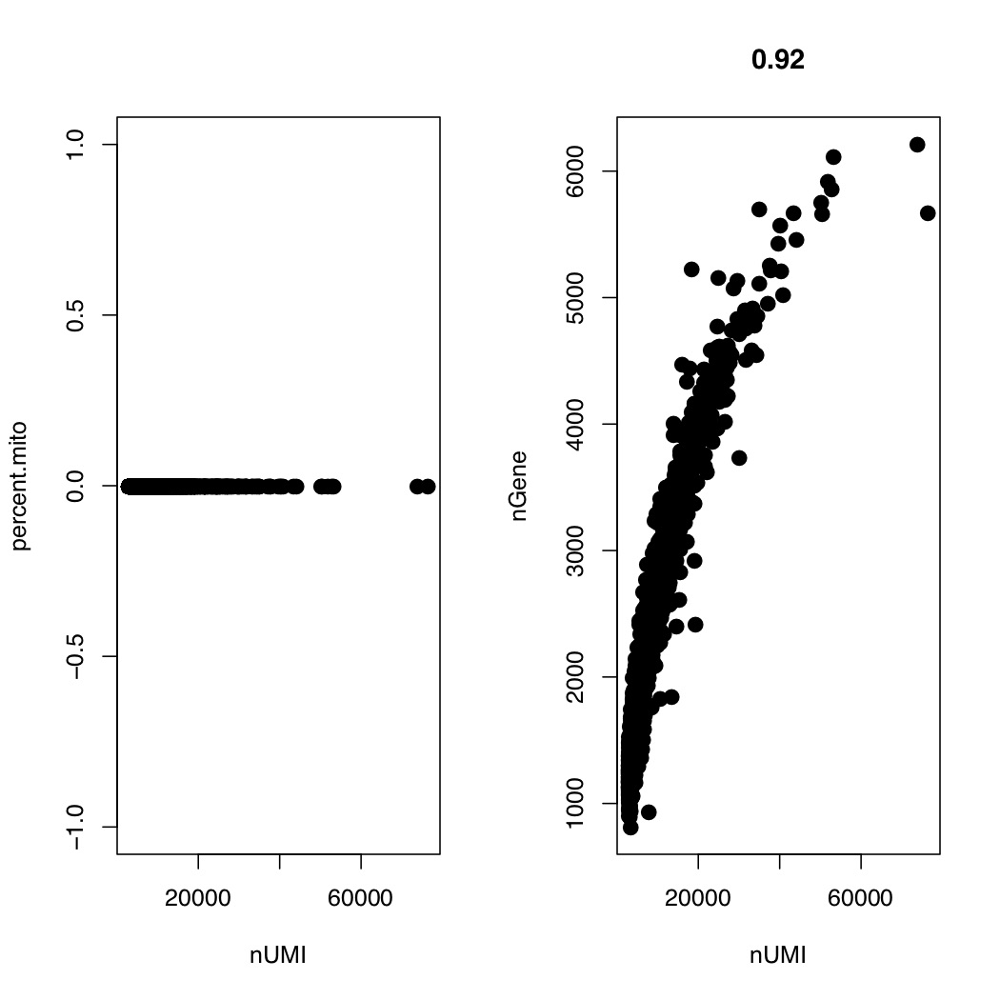
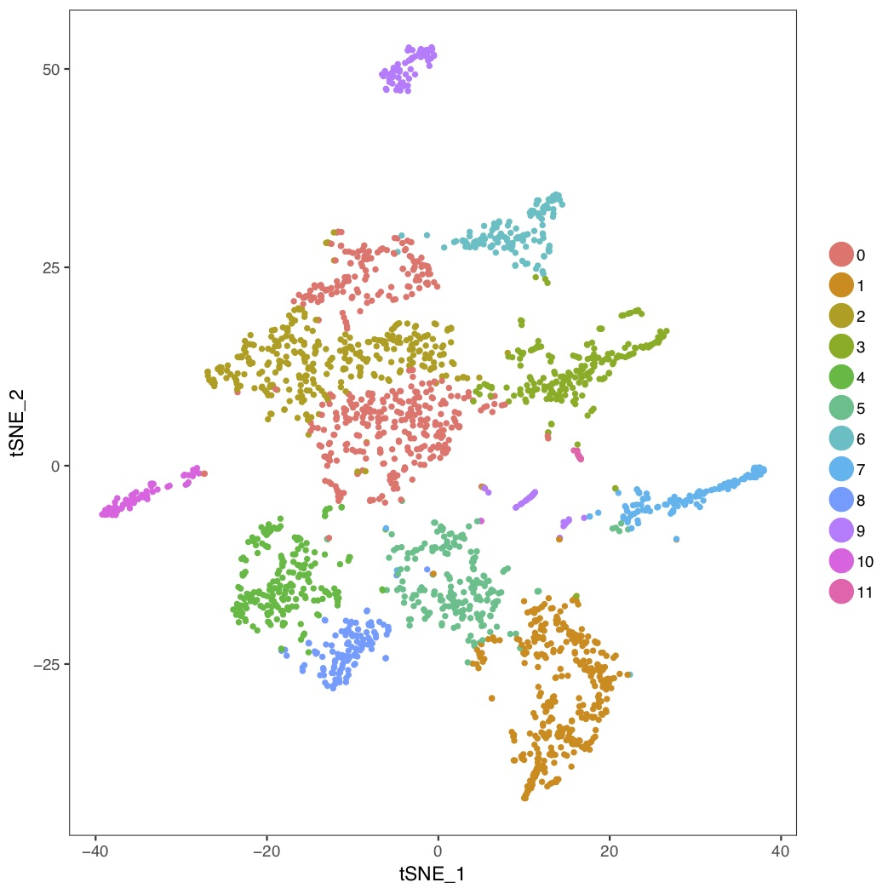

# Final Project
The goal of this project is to use single cell RNAseq data to produce tSNE plots for further analysis. The sequencing data was produced with 10x Genomics Chromium system.The R package "Seurat" is used for analysis.

I thought there would be many bash commands and pipelines before I started this project. But it turns out to be that everything can just be done in R. To fit the study goal of this course, I divided the work in R into pieces and make a toy bash script: in real research, this kind of implementation is not ideal because this way of exploratory data analysis is not intuitional.

The first step is to initiate working environment. Because it's a simple project, I didn't use "creatProject" script. I just arranged the directories and files by myself.

```
.
├── README.md
├── figures
├── qc.r
├── raw
│   └── mm10GTN
│       ├── barcodes.tsv
│       ├── genes.tsv
│       └── matrix.mtx
├── scrna_tsne.sh
├── temp
└── tsne.r
```

The raw data has been processed with Cell Ranger by 10x Genomics and is ready to use.

I had some problem installing R packages on HPC. So I just used my own Mac. The scrips should be able to run on HPC with some modifications. The version of R is 3.4.2. The macOS version is 10.14.1 (Mojave) with the kernel Darwin 18.2.0. And the package "Seurat" was installed with "install.package("Seurat")" in R CLI.

Before running the scripts, the permission should be modified.

```
chmod 755 name.script
```

There are 3 script files. scrna_tsne.sh is the "main" bash script used to start the analysis. And two R scripts are actually used to finish the analysis. For R scripts, I mainly followed the [tutorial (https://satijalab.org/seurat/pbmc3k_tutorial.html)](https://satijalab.org/seurat/pbmc3k_tutorial.html) with some minor modifications. I used settings shown in the tutorial unless specified.

```
./scrna_tsne.sh
```

The script runs qc.r first, which will automatically load dataset and finish the plots used for QC. The intermediate data are stored in "./temp". With the help of the plots, we can assign the threshold to exclude out non-single cells.



Because the mitochondria genes have been filtered out when creating Seurat object, the percetn.mito has no useful information. For nGene, I use 200 and 5000 as cutoffs.

```
200 -Inf 5000 +Inf
```

And then the tsne.r will do normalization, scaling, clustering with PCA, and give out the final result of tSNE.

